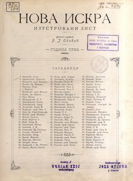

# NovaIskra
## UNILIB &amp; JeRTeh :: projekat u oblasti kulturnog nasleđa i bibliotečko-informacione delatnosti 
 

Časopis [Nova Iskra](https://pretraziva.rs/pregled/nova-iskra) na sajtu Iniverzitetske biblioteke "Svetozar Marković" Univerziteta u Beogradu

 
|---------------------------|-------------------------------------------------------------------------------------------------------------------------------------------------------------|
|  | **Nova Iskra** je ilustrovani list čiji je vlasnik i odgovorni urednik bio Rista J. Odavić. Od 1911. godine vlasnik je Živojin O. Dačić. List je u početku izlazio 2 puta, a kasnije jednom mesečno. Izlazio je od 1899. do 1911. godine. |
